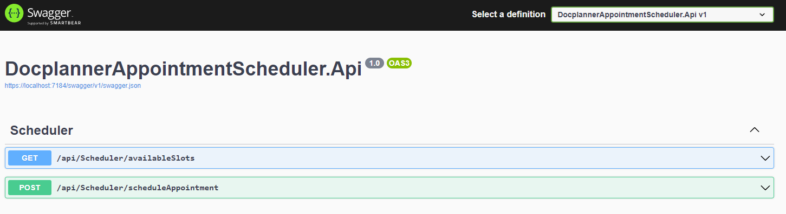
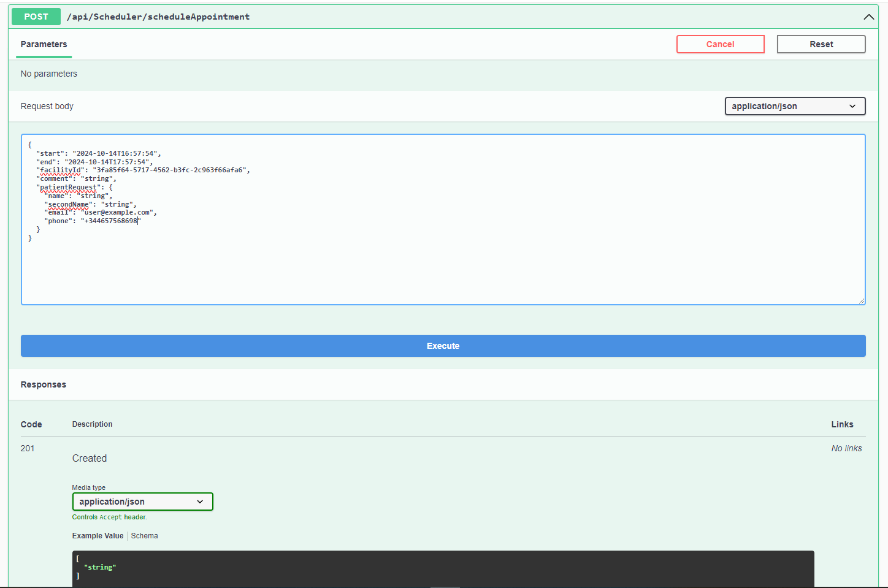

# Docplanner Appointment Scheduler

## 🥼🕛 Application Use Case

Using this Appointment Scheduler, patients can book appointments with a doctor.

## 📄 Requirements

- Patients are able to see available slots in a given week.
- Patients are able to select an available slot, fill their details and book an appointment.

## 🕵🏻‍♂️ Assumptions

*- Doctors interact with the availability service, we have no control over it.*

*- Facility is fixed by the availability service, we have no control over it. We assume that at a previous stage the patient selected the facility.*

*- There will be always at the most 1 facility inside the external availability service response.* 

*- In reality, external availability service should store busy slots from us when we make an appointment. It doesn´t, but we assume it does.*

*- Patients interact with the appointment scheduler service, we have control over it.*

*- Patients can book 1 slot at a time.*

*- We assume that the patients already have created a user in the appointment scheduler, so we don´t handle authentication here.* 

*- We assume we don´t store the appointments in a database, that could be done in a further step of development.*


🧪 **ANY OTHER ASSUMPTIONS CAN BE DERIVED FROM TESTS.** Find tests under the test folder in this repository.


## 🏃🏻‍♂️ How to run the Appointment Scheduler


### Preconditions
Before running the application, ensure that the following preconditions are met:

1. **Environment Variables Setup**:

   The application depends on two environment variables for authentication with the external availability service:
   - `AvailabilityServiceUser`: The username for the availability service.
   - `AvailabilityServicePassword`: The password for the availability service.

   Ensure that these environment variables are properly configured in your system or development environment. You can set them up using the following commands (depending on your OS):

   - **For Windows (Powershell)**:
     ```powershell
     $env:AvailabilityServiceUser = "your_username"
     $env:AvailabilityServicePassword = "your_password"
     ```

   - **For macOS/Linux**:
     ```bash
     export AvailabilityServiceUser="your_username"
     export AvailabilityServicePassword="your_password"
     ```
   **These environment variables are mandatory for the service to function.** If they are not set, the API will return a `503 Service Unavailable` response with an error message indicating which environment variable is missing. 

   For example, the response might look like this:

        ```json
        {
           "message": "External service error getting available slots for week 42, year 2024.",
           "reason": "The external availability service returned Unauthorized.",
           "details": "The external availability service returned the follorwing content: Configuration error: AvailabilityServiceUser environment variable is missing.. Please ensure all required environment variables are set."
        }   
        ```


2. **Required Software**:
   
   - [.NET 8.0 SDK](https://dotnet.microsoft.com/download/dotnet/8.0): Ensure you have the .NET 8.0 SDK installed.


### Running the application

1. **Clone the Repository**  
   Clone the repository to your local machine using the following command:  
   ```bash
   git clone https://github.com/DamianCapdevila/docplanner-appointment-scheduler.git
   ```
2. **Restore Dependencies**
   
   Navigate to the repository directory using:
   ```bash
   cd docplanner-appointment-scheduler  
   ```
   Restore dependencies using:
   ```bash
   dotnet restore  
   ```
3. **Start the Application**

   Navigate to the src directory using:
   ```bash
   cd src  
   ```
   Start the application using:
   ```bash
   dotnet run --project DocplannerAppointmentScheduler.Api 
   ```
### 💻 Accessing the application

   Once the application is running, you can access the API Swagger UI at: http://localhost:5234/swagger
   The application runs by default in that port. You can modify where it runs, in case the port is occupied. See section below.
   
### 🕷 Troubleshooting


- If the port 5234 is occupied, you may have issues running the app. In that case, you can start the application specifying other ports, using this command inside the src directory:

  ```bash
   dotnet run --project DocplannerAppointmentScheduler.Api --urls "http://localhost:[YourAvailablePort];https://localhost:[AnotherAvailablePort]"
   ```
  Where [YourAvailablePort] and [AnotherAvailablePort] must be replaced by 2 different port numbers that are available in your host.

  ***The application will be running and you can see its UI at: http://localhost:[YourAvailablePort]/swagger or at https://localhost:[AnotherAvailablePort]/swagger***
  
- If the availability service is down, you will receive a `503 Service Unavailable` error when attempting to schedule or retrieve appointments. Ensure that the external service is available before proceeding.

- If the required environment variables are not set, the API will return a `400 Bad Request` response with an error message indicating which environment variable is missing. **Refer to the [Preconditions](#preconditions) section for for hints on how to set the required environment variables.**

## 👆🏻🖱 Using the application

After successfully running the application, you will see something like this in your browser:
)
**To see the availability of a given week, please use this endpoint:**


**Make sure you pass correct parameters for the WeekNumber and Year:** 
- WeekNumber should be a value between current calendar week and 53.

- Year should be a value between current calendar year and the maximum of an int value *(hopefully technology will be much better than this by then :P).*


*Calling this endpoint, if everything is correct, will return a response with the following structure:*

```json
{
  "facility": {
    "facilityId": "bea5bc63-7db5-466e-8a5c-398a9c94c380",
    "name": "Las Palmeras",
    "address": "Plaza de la independencia 36, 38006 Santa Cruz de Tenerife"
  },
  "daySchedules": [
    {
      "day": "Sunday",
      "availableSlots": []
    },
    {
      "day": "Monday",
      "availableSlots": [
        {
          "start": "2024-10-14T09:40:00",
          "end": "2024-10-14T09:50:00"
        },
        {
          "start": "2024-10-14T09:50:00",
          "end": "2024-10-14T10:00:00"
        },
        {
          "start": "2024-10-14T10:00:00",
          "end": "2024-10-14T10:10:00"
        },
        {
          "start": "2024-10-14T10:10:00",
          "end": "2024-10-14T10:20:00"
        },
        {
          "start": "2024-10-14T10:30:00",
          "end": "2024-10-14T10:40:00"
        },
    }
}
```
You can then use the available slots values to schedule an appointment. See below how.

**To schedule an appointment, please use this endpoint:**



Make sure the request body is correct. See an example below:

```json
{
  "start": "2024-10-14T16:57:54",
  "end": "2024-10-14T17:57:54",
  "facilityId": "3fa85f64-5717-4562-b3fc-2c963f66afa6",
  "comment": "Hire Damian Capdevila :P",
  "patientRequest": {
    "name": "string",
    "secondName": "string",
    "email": "user@example.com",
    "phone": "+344657568698"
  }
}
```
- start and end should be formatted like: yyyy-MM-ddTHH:mm:ss
- start and end should be in the future respect to the current   time.
- phone number should be valid.

There are more requirements, the api will return bad request and tell you what´s wrong in case you miss one :).

If the appointment is successfully created, the api will return
a 201 Created Error with the following object:
```json
{
  "message": "Appointment scheduled successfully!"
}
```

